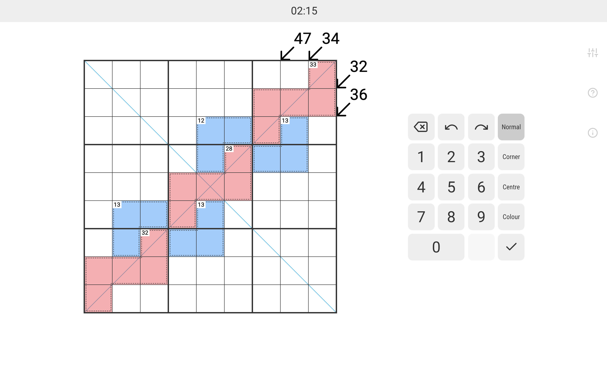
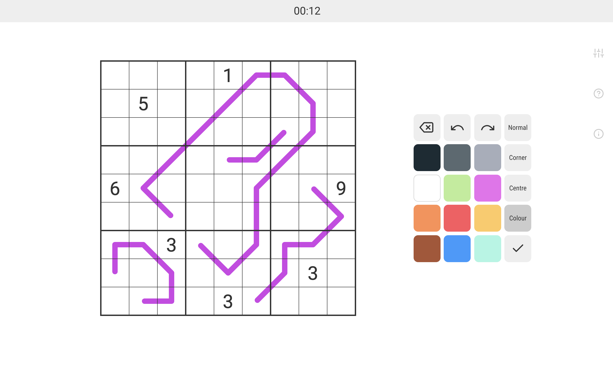
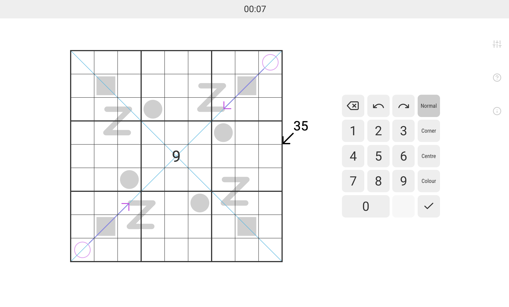
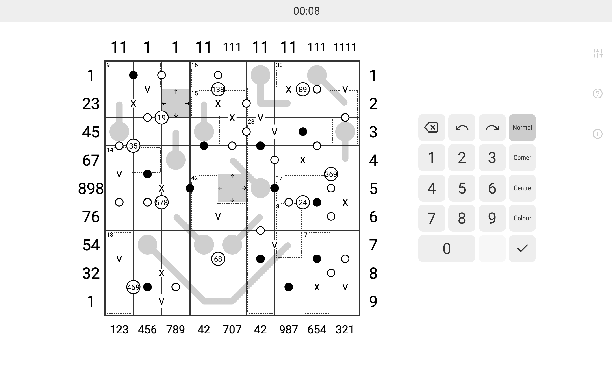

<h1 align="center">
   
   
  
   
   
   
</h1>

> A modern web app for Sudoku

 

Sudocle offers the following features:

* Lightweight and clean look
* Optimised for various devices (mobile and desktop) as well as screens (any
  size and resolution)
* Configurable interface:
  * Themes (including dark mode)
  * Colour palettes (including one optimised for colour blindness)
  * Custom colour palette
  * Zoom
  * Font sizes
  * and other options
* Fully compatible with puzzles published by [Cracking the Cryptic](https://www.youtube.com/c/CrackingTheCryptic)
  (see [usage instructions](#using-the-online-version) below)
* High performance graphics renderer using WebGL or HTML Canvas

Sudocle has been inspired by the official web app of
[Cracking the Cryptic](https://www.youtube.com/c/CrackingTheCryptic), the
world’s most popular YouTube channel about Sudoku and other logic puzzles.

## Using the online version

An online version of Sudocle is available at:

https://michelkraemer.com/sudocle

If you want to play one of the puzzles featured on
[Cracking the Cryptic](https://www.youtube.com/c/CrackingTheCryptic) in
Sudocle, just copy the puzzle’s ID from the CTC webapp and append it to the
URL shown above.

For example, the “Miracle Sudoku” by Mitchell Lee, one of the most popular
puzzles ever featured on the channel, has the following URL:

<a href="https://app.crackingthecryptic.com/tjN9LtrrTL">https:‎//app.crackingthecryptic.com/<strong>tjN9LtrrTL</strong></a>

This URL becomes:

<a href="https://michelkraemer.com/sudocle/tjN9LtrrTL">https:‎//michelkraemer.com/sudocle/<strong>tjN9LtrrTL</strong></a>

## Screenshots

Here are some random screenshots (no spoilers!):

<table>
  <tr>
    <td>
       
      <strong>The Gordian Knot</strong> by Joseph Nehme 
      <a href="https://michelkraemer.com/sudocle/rb7G2grJmN">https://michelkraemer.com/sudocle/rb7G2grJmN</a>
      <a href="https://www.youtube.com/watch?v=xNYwB8GEerE">https://www.youtube.com/watch?v=xNYwB8GEerE</a>
    </td>
    <td>
      
      <strong>German Whispers</strong> by Philipp Blume 
      <a href="https://michelkraemer.com/sudocle/QM8RdBLBb9">https://michelkraemer.com/sudocle/QM8RdBLBb9</a>
      <a href="https://www.youtube.com/watch?v=nH3vat8z9uM">https://www.youtube.com/watch?v=nH3vat8z9uM</a>
    </td>
  </tr>
  <tr>
    <td>
      
      <strong>Blackjack</strong> by apiyo 
      <a href="https://michelkraemer.com/sudocle/Qm88j7J2dt">https://michelkraemer.com/sudocle/Qm88j7J2dt</a>
      <a href="https://www.youtube.com/watch?v=eWZQcPWiroc">https://www.youtube.com/watch?v=eWZQcPWiroc</a>
    </td>
    <td>
      
      <strong>Chaotic Wrogn</strong> by Undar Beyond 
      <a href="https://michelkraemer.com/sudocle/6dP4FN27HB">https://michelkraemer.com/sudocle/6dP4FN27HB</a>
      <a href="https://www.youtube.com/watch?v=zfIomUELg6c">https://www.youtube.com/watch?v=zfIomUELg6c</a>
    </td>
  </tr>
</table>

## Building and running Sudocle locally

Sudocle requires [Node.js](https://nodejs.org/) v15 or higher. Run the
application in development mode with the following commands:

    npm install
    npm run dev

Open your web browser and go to <http://localhost:3000> to open the main page.
Just like with the online version, you can append a Cracking the Cryptic puzzle
ID to the URL (e.g. <http://localhost:3000/tjN9LtrrTL>).

Sudocle has been built with [Next.js](https://nextjs.org/). In development mode,
Next.js watches for source code changes and automatically refreshes the
application in the browser.

If you want to build Soducle in production mode, use the following command:

    npm run build

This will create a directory called `out`, which you can upload to your web
server.

Alternatively, you can run Sudocle with [Docker](https://www.docker.com/) as
follows:

    docker build -t sudocle .
    docker run -it -p 80:3000 --name sudocle --rm sudocle

Then, open <http://localhost/sudocle/>.

## What does “Sudocle” mean?

The name *Sudoku* is an abbreviation of the Japanese expression “Sūji wa
dokushin ni kagiru” (数字は独身に限る), which can be translated to “the digits
must be single” [[Wikipedia](https://en.wikipedia.org/wiki/Sudoku)]. *Sūji*
means *digits*.

A *monocle*, a *binocle*, or a pair of *binoculars* are things that help people
see.

*Sudocle* therefore helps people see digits 🤓😉

## License

Sudocle is released under the **MIT license**. See the [LICENSE](LICENSE) file
for more information.
